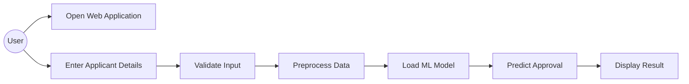

# Use Case Diagram

## Actors

1. User
2. Machine Learning Model
3. Administrator (Future Enhancement)

---

## Use Case Description

The user enters applicant information into the web application. The system validates the data, preprocesses it, loads the trained model, predicts the approval status, and displays the result.

---

## Mermaid Use Case Diagram

---

## Use Cases

| Use Case | Description |
|-----------|-------------|
| Open Application | Access the web interface |
| Enter Details | Input applicant information |
| Validate Data | Check data correctness |
| Predict | ML model predicts approval |
| View Result | Display approval status |