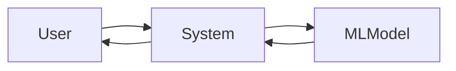
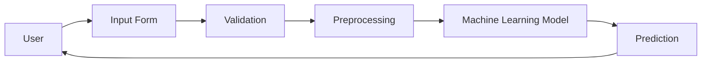

# Data Flow Diagram

## Level 0 DFD

```mermaid
flowchart LR

User --> System

System --> MLModel

MLModel --> System

System --> User
```

---

## Level 1 DFD

```mermaid
flowchart LR

A[User]

B[Input Form]

C[Validation]

D[Preprocessing]

E[Machine Learning Model]

F[Prediction]

A --> B

B --> C

C --> D

D --> E

E --> F

F --> A
```

---

## Explanation

The DFD illustrates how applicant information flows through the system from input collection to prediction output.