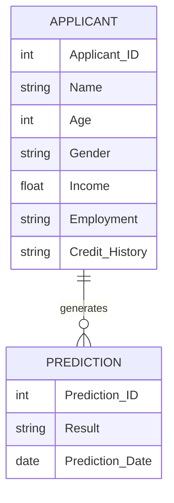

# Entity Relationship Diagram

## Overview

Although the current application does not use a database, the following ER diagram represents a future implementation where applicant records and prediction history are stored.

---

## Entities

### Applicant

- Applicant ID
- Name
- Age
- Gender
- Income
- Employment Status
- Credit History

### Prediction

- Prediction ID
- Applicant ID
- Prediction Result
- Prediction Date

---

## ER Diagram

---

## Relationship

One applicant can have multiple prediction records over time.