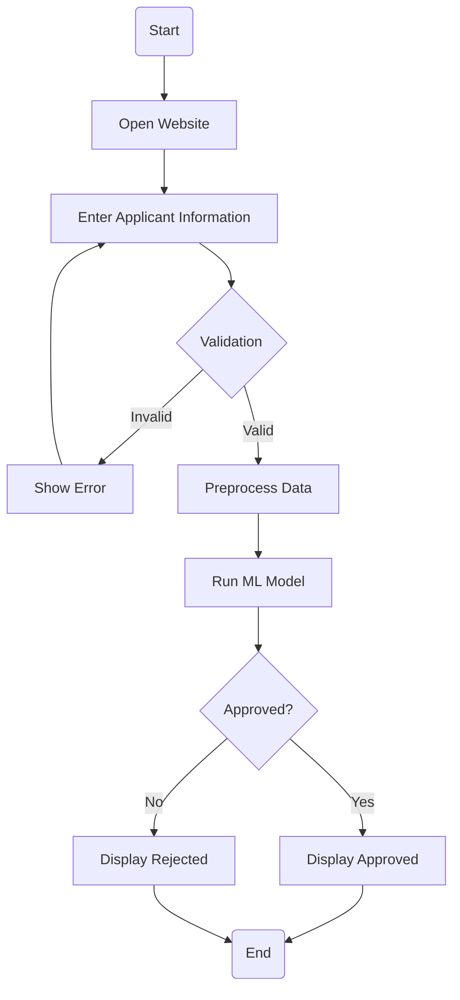

# System Flowchart

## Process Flow

---

## Description

This flowchart represents the complete execution flow of the Credit Card Approval Prediction application from user input to final prediction.