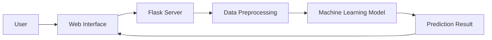

# System Architecture

## Overview

The Credit Card Approval Prediction System follows a layered architecture consisting of the User Interface, Flask Backend, Machine Learning Model, and Prediction Output. The user interacts with a web application by entering applicant details. The backend validates and preprocesses the data before sending it to the trained Machine Learning model. Finally, the prediction result is displayed on the web page.

---

## Components

### 1. User Interface

The user interface is developed using HTML and CSS. It provides a simple form where users enter applicant details such as age, income, employment status, education, and credit history.

### 2. Flask Backend

The Flask framework handles incoming HTTP requests, validates user inputs, preprocesses the data, and communicates with the Machine Learning model.

### 3. Data Preprocessing

The preprocessing module performs:

- Handling missing values
- Encoding categorical variables
- Feature scaling
- Data transformation

### 4. Machine Learning Model

The trained model receives processed input data and predicts whether the applicant's credit card request should be approved or rejected.

### 5. Prediction Output

The predicted result is returned to the Flask application and displayed to the user.

---

## Architecture Diagram

---

## Advantages

- Modular architecture
- Easy maintenance
- Scalable design
- Fast prediction
- Separation of concerns