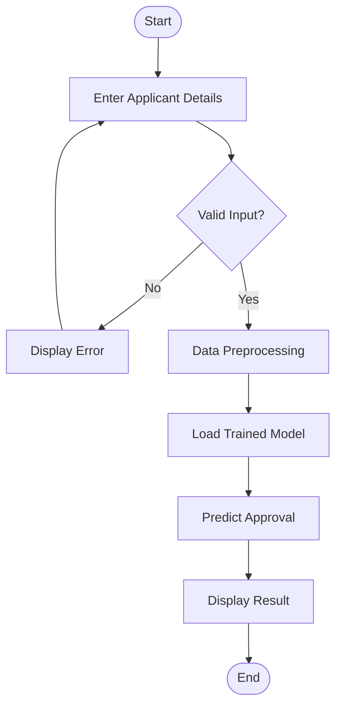

# Workflow Diagram

## Workflow Description

The workflow begins when the user enters applicant information into the web application. The backend validates the information, preprocesses it, loads the trained model, predicts the approval status, and displays the result.

---

## Workflow Diagram

