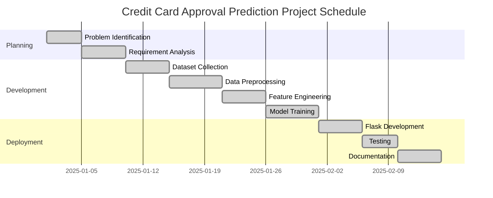

# Gantt Chart

## Overview

A Gantt Chart is a project management tool that illustrates the timeline of project activities, their duration, and dependencies. It helps in tracking the progress of each phase from project initiation to deployment.

---

## Project Schedule

| Task | Week 1 | Week 2 | Week 3 | Week 4 | Week 5 | Week 6 |
|------|:------:|:------:|:------:|:------:|:------:|:------:|
| Problem Identification | ███ | | | | | |
| Requirement Analysis | ███ | █ | | | | |
| Dataset Collection | | ███ | | | | |
| Data Preprocessing | | ███ | █ | | | |
| Exploratory Data Analysis | | | ███ | | | |
| Feature Engineering | | | ███ | █ | | |
| Model Development | | | | ███ | █ | |
| Model Evaluation | | | | | ███ | |
| Flask Integration | | | | | ███ | █ |
| Testing | | | | | | ███ |
| Documentation | █ | █ | █ | █ | █ | █ |
| Final Deployment | | | | | | ███ |

---

## Mermaid Gantt Chart

---

## Conclusion

The project followed a structured schedule, ensuring timely completion of all development phases while maintaining quality and accuracy.