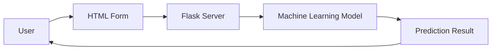

# Flask Development

## Overview

Flask was used to deploy the trained Machine Learning model as a web application, allowing users to interact with the prediction system through a browser.

---

## Application Workflow

1. User opens the web application.
2. Applicant details are entered.
3. Flask receives the request.
4. Data is preprocessed.
5. The trained model generates a prediction.
6. Flask displays the result.

---

## Technology Stack

| Component | Technology |
|------------|------------|
| Backend | Flask |
| Frontend | HTML, CSS |
| Machine Learning | Scikit-learn |
| Model Storage | Joblib |

---

## Flask Architecture

---

## Benefits

- Easy deployment
- Lightweight framework
- Real-time prediction
- User-friendly interface