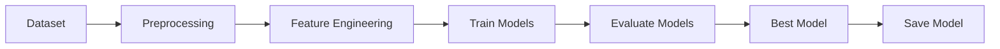

# Model Building

## Overview

Several Machine Learning algorithms were trained and compared to determine the most suitable model for predicting credit card approval.

---

## Development Process

1. Load cleaned dataset.
2. Separate features and target variable.
3. Split data into training and testing sets.
4. Train multiple algorithms.
5. Compare performance.
6. Select the best-performing model.
7. Save the trained model using Joblib.

---

## Machine Learning Pipeline

---

## Model Storage

The trained model is serialized using Joblib for later use in the Flask web application.