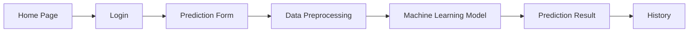

# Application Screenshots

## Overview

This section presents the major screens of the **Credit Card Approval Prediction System**. Each screenshot represents a key functionality of the application and demonstrates the workflow from user authentication to prediction history.

---

# 1. Home Page

## Description

The Home Page serves as the landing page of the application. It introduces users to the Credit Card Approval Prediction System and provides navigation to different modules such as Login, Prediction, and History.

### Features

- Clean and responsive interface
- Project introduction
- Navigation menu
- Quick access to Login page
- User-friendly design

### Screenshot

> **Insert:** `Home_Page.png`

```markdown

```

---

# 2. Login Page

## Description

The Login Page allows authorized users to securely access the prediction system. Users must provide valid login credentials before using the application.

### Features

- Username input
- Password input
- Login button
- Input validation
- Secure authentication

### Workflow

1. User enters username.
2. User enters password.
3. System validates credentials.
4. User is redirected to the Prediction page.

### Screenshot

> **Insert:** `Login_Page.png`

```markdown

```

---

# 3. Prediction Process Page

## Description

The Prediction Page allows users to enter applicant details required for credit card approval prediction.

The entered information is processed by the Machine Learning model through the Flask backend.

### Input Fields

- Applicant Name
- Gender
- Age
- Annual Income
- Employment Status
- Marital Status
- Education
- Credit History
- Existing Loans

### Features

- Form validation
- Easy data entry
- Responsive layout
- Real-time submission

### Workflow

1. User fills applicant information.
2. Clicks **Predict**.
3. Data is sent to Flask.
4. Data preprocessing is performed.
5. Machine Learning model generates prediction.

### Screenshot

> **Insert:** `Prediction_Process.png`

```markdown

```

---

# 4. Prediction Result Page

## Description

After successful processing, the application displays whether the applicant is **Approved** or **Rejected**.

The prediction result is generated using the trained Machine Learning model.

### Output

- Approval Status
- Prediction Message
- Confidence (if implemented)

### Features

- Instant prediction
- Clear result display
- Easy navigation
- Predict Again option

### Screenshot

> **Insert:** `Prediction_Result.png`

```markdown

```

---

# 5. History Page

## Description

The History Page stores previously generated predictions, allowing users to review past approval results.

This feature helps maintain a record of prediction requests and improves traceability.

### Information Displayed

- Applicant Name
- Prediction Date
- Approval Status
- Timestamp

### Features

- View previous predictions
- Search records (future enhancement)
- Filter history (future enhancement)
- Download history (future enhancement)

### Workflow

1. User opens History page.
2. System retrieves stored prediction records.
3. Previous predictions are displayed in a table.

### Screenshot

> **Insert:** `History_Page.png`

```markdown

```

---

# Application Workflow



---

# Summary

The application provides a simple and intuitive workflow that enables users to securely log in, submit applicant information, obtain real-time credit card approval predictions, and review previous prediction history. The combination of Flask and Machine Learning ensures fast, accurate, and reliable decision support for credit card approval.