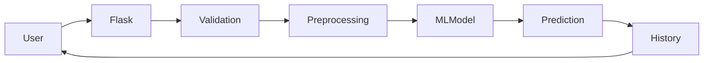

# Integration Testing

## Overview

Integration testing ensures that different components of the application work together correctly after combining them.

---

## Components Integrated

- HTML User Interface
- Flask Backend
- Data Preprocessing
- Machine Learning Model
- Prediction Module
- History Module

---

## Integration Flow

---

## Test Results

| Integration | Expected Result | Status |
|--------------|----------------|--------|
| UI → Flask | Data received | ✅ Pass |
| Flask → Preprocessing | Data transformed | ✅ Pass |
| Preprocessing → Model | Prediction generated | ✅ Pass |
| Model → Result | Output displayed | ✅ Pass |
| Result → History | Stored successfully | ✅ Pass |

---

## Conclusion

The integrated system functioned correctly with seamless communication between all modules.