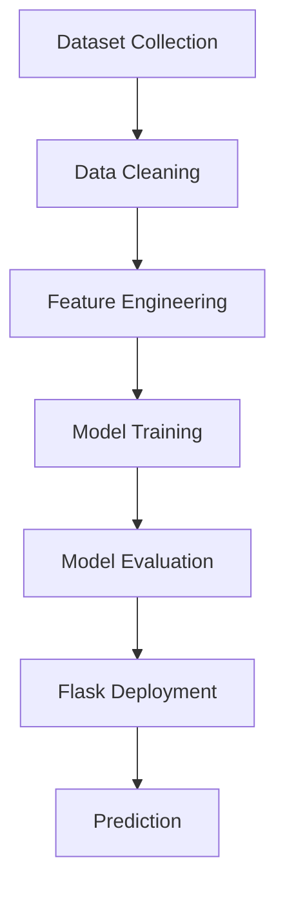

# Methodology

## Overview

The project follows a systematic Machine Learning pipeline from data collection to deployment.

## Development Methodology

1. Dataset Collection
2. Data Exploration
3. Data Preprocessing
4. Feature Engineering
5. Model Selection
6. Model Training
7. Model Evaluation
8. Flask Deployment
9. Testing
10. Documentation

---

## Workflow

## Advantages

- Structured development process
- Improved model performance
- Easy maintenance
- Scalable architecture