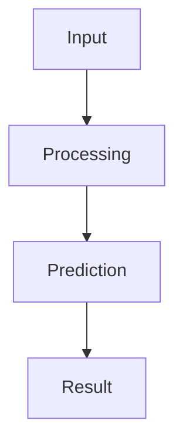

# Output Screenshots

## Overview
This document belongs to the **Credit Card Approval Prediction** project developed using Python, Flask and Machine Learning.

## Details
- Purpose: Support professional documentation.
- Project: Credit Card Approval Prediction
- Author: Balaji
- Suitable for GitHub, SkillWallet and academic evaluation.

## Content
This section explains the topic in detail with objectives, workflow, considerations and best practices.

